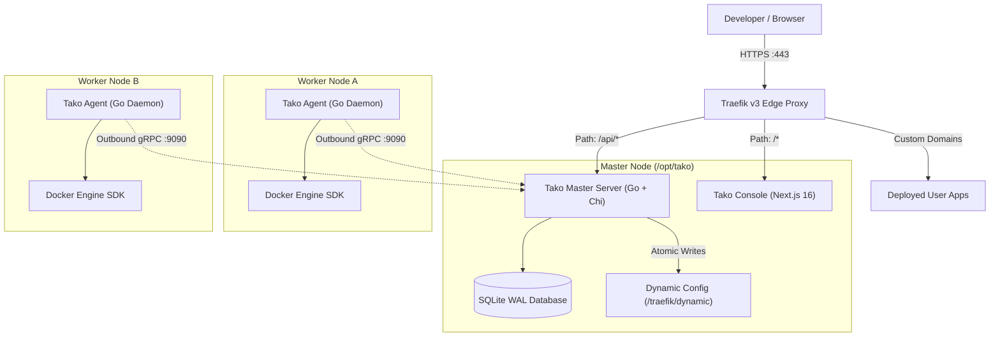

<div align="center">


# Tako

**The lightweight, self-hosted Platform-as-a-Service.**  
Zero-SSH multi-node orchestration, automated Let's Encrypt TLS, dynamic Traefik routing, and WebAuthn security.

[](https://golang.org)
[](https://nextjs.org)
[](https://traefik.io)
[](https://docker.com)
[](LICENSE)
[](https://docs.gettako.dev)
[](CONTRIBUTING.md)

[Quickstart](#quick-start) • [Architecture](#architecture) • [Features](#key-features) • [Documentation](https://docs.gettako.dev) • [Contributing](CONTRIBUTING.md)

</div>

---

## Overview

**Tako** is an open-source, resilient PaaS designed to give developers and DevOps teams the seamless developer experience of Heroku or Coolify without the bloat, complex dependencies, or security hazards of opening SSH ports on remote servers.

> [!WARNING]
> **Active Heavy Development**: Tako is under rapid, continuous development and is currently in early preview. Features, database schemas, and configuration structures may change abruptly, and bugs are to be expected. It is not yet recommended for mission-critical production workloads.

Written in **Go** and **Next.js**, Tako coordinates deployments across one or dozens of server nodes using outbound **gRPC streaming** and powers edge routing with **Traefik v3**.



---

## Key Features

- 🚀 **Zero-SSH Architecture**: Worker nodes dial **outbound** to the Master Server via long-lived bidirectional gRPC (`StreamTasks`). No SSH keys to distribute, no firewall holes to punch on worker nodes.
- 🔒 **Enterprise-Grade Identity**: Native support for **FIDO2 / WebAuthn Passkeys** (Touch ID, Face ID, YubiKey), Time-based One-Time Passwords (**TOTP 2FA**), and HTTP-only session cookies.
- 🌐 **Dynamic Traefik v3 Routing**: High-performance reverse proxy with automatic SSL certificate management via Let's Encrypt (HTTP-01 & TLS-ALPN-01), zero-downtime reloads, and atomic configuration file generation.
- 📦 **Git & Webhook Deployments**: Deploy directly from GitHub repositories using the Tako GitHub App, branch tracking, and webhook triggers, or pull pre-built Docker images directly.
- ⚡ **Lightweight & Efficient**: The Master Server runs as a single Go binary backed by an embedded SQLite database in **WAL mode** (`journal_mode=WAL`), consuming minimal CPU and RAM idle overhead.
- 📊 **Real-time Observability**: Live log streaming using Server-Sent Events (SSE), container heartbeat telemetry, and memory/CPU usage monitoring across all nodes.
- 🛡️ **Comprehensive Audit Trail**: Every sensitive action—deployments, rollbacks, node enrollments, environment variable modifications, and credential updates—is immutably recorded in audit logs.

---

## Quick Start

### 1. Install Master Server

Deploy a complete Tako master node (Master Server, Next.js Console, Traefik v3, and SQLite database) on any clean Linux server running Ubuntu, Debian, or Rocky Linux:

```bash
curl -fsSL https://gettako.dev/install.sh | bash
```

The interactive installer will prompt you for:
- Console domain name (e.g., `tako.yourdomain.com`)
- Admin email address (for Let's Encrypt TLS and administrative login)
- Initial admin password
- Node public IP

Once installation completes, visit your console URL in your browser and complete the onboarding checklist.

### 2. Attach Worker Nodes (Optional)

Scale your compute capacity by attaching additional worker nodes across any cloud provider or bare-metal host:

1. In the Tako Console, navigate to **Nodes** → **Enroll Node** and generate a temporary enrollment token.
2. Run the installer in agent mode on the target machine:

```bash
curl -fsSL https://gettako.dev/install.sh | bash -s -- --agent
```

3. Provide the Master Server gRPC address (`master.yourdomain.com:9090`) and the enrollment token when prompted. The agent connects instantly over outbound gRPC.

---

## Architecture & Tech Stack

| Component | Technology | Role |
| :--- | :--- | :--- |
| **Console** | Next.js 16, React 19, Tailwind CSS v4, Lucide | Modern, reactive web UI and Backend-for-Frontend (BFF) |
| **Server** | Go 1.24+, Chi v5, SQLite (WAL mode) | REST API, state store, gRPC orchestrator, SSE hub |
| **Agent** | Go 1.24+, Docker Engine SDK, gRPC client | Node worker daemon, container lifecycle, host telemetry |
| **Proxy** | Traefik v3 (Dynamic File Provider) | Edge ingress, auto Let's Encrypt TLS, domain routing |
| **Protocol** | Protocol Buffers v3 & gRPC | Low-latency RPC contract between Server and Agents |
| **Docs** | Mintlify MDX & OpenAPI 3.1 | Technical documentation and interactive API reference |

---

## Monorepo Layout

```
gettako/
├── agent/            # Go node daemon connecting to local Docker Engine SDK
│   ├── cmd/agent/    # Agent entrypoint
│   └── internal/     # Docker runner, telemetry collector, gRPC client
├── console/          # Next.js 16 dashboard
│   ├── app/          # App router pages and BFF API routes
│   ├── components/   # UI components (Tailwind v4)
│   └── lib/          # API client, WebAuthn helpers, authentication
├── deploy/           # Production deployment definitions
│   ├── compose.master.yml  # Master node Docker Compose stack
│   ├── compose.agent.yml   # Worker node Docker Compose stack
│   ├── scripts/install.sh  # Universal installer script
│   └── traefik/            # Traefik v3 static configuration
├── docs/             # Mintlify documentation & OpenAPI 3.1 specification
│   ├── architecture/ # In-depth technical architecture guides
│   ├── installation/ # Bare-metal and Docker installation instructions
│   ├── guides/       # User guides for services, deployments, and logging
│   └── openapi.yaml  # Complete OpenAPI specification
├── plans/            # Milestones and engineering specifications
├── proto/            # Protocol buffer definitions (tako.proto)
└── server/           # Go master orchestrator
    ├── cmd/server/   # Server entrypoint
    ├── internal/     # Domain packages: auth, nodes, services, deployments
    └── migrations/   # SQLite schema migrations
```

---

## Local Development

To run Tako locally for development:

```bash
# 1. Clone repository
git clone https://github.com/gettako/gettako.git
cd gettako

# 2. Run the Master Server
cd server
cp .env.example .env
go run ./cmd/server

# 3. Run the Agent (in a new terminal)
cd ../agent
cp .env.example .env
go run ./cmd/agent

# 4. Run the Web Console (in a new terminal)
cd ../console
npm install
npm run dev
```

Visit [http://localhost:3000](http://localhost:3000) to access the console locally.

For detailed development guidelines, coding conventions, and testing instructions, please read [CONTRIBUTING.md](CONTRIBUTING.md).

---

## Documentation

Full documentation is available at [https://docs.gettako.dev](https://docs.gettako.dev):

- [Getting Started & Introduction](https://docs.gettako.dev/introduction)
- [5-Minute Quickstart Guide](https://docs.gettako.dev/quickstart)
- [Master Server Installation](https://docs.gettako.dev/installation/main-server)
- [Worker Node Installation](https://docs.gettako.dev/installation/node-server)
- [Architecture & gRPC Protocol](https://docs.gettako.dev/architecture/grpc-communication)
- [Traefik Routing & Auto-TLS](https://docs.gettako.dev/architecture/traefik-routing)
- [OpenAPI Reference](https://docs.gettako.dev/api-reference)

---

## Security

Security is foundational to Tako. If you discover a security vulnerability, please review our [Security Policy](SECURITY.md) and report it privately via GitHub Security Advisories or by emailing [security@gettako.dev](mailto:security@gettako.dev). Please do not disclose vulnerabilities through public issues.

---

## Community & Contributing

Contributions from the community are what make open-source software great. We welcome bug reports, feature requests, documentation improvements, and pull requests.

- Read our [Contributing Guide](CONTRIBUTING.md) to get started.
- Check open issues and active discussions on GitHub.
- Submit pull requests adhering to our Conventional Commits standard.

---

## License

Tako is licensed under the **Apache License, Version 2.0**. See the [LICENSE](LICENSE) file for the full license text.
