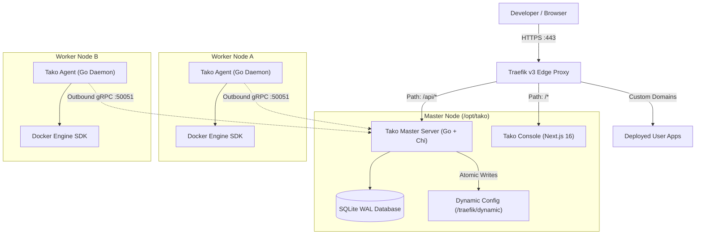

<div align="center">


# Tako

**The lightweight, self-hosted deployment platform.**  
Outbound gRPC node orchestration, automated Let's Encrypt TLS, dynamic Traefik routing, and WebAuthn authentication.

[](https://golang.org)
[](https://docs.gettako.dev)
[](LICENSE)
[](CONTRIBUTING.md)

[Documentation](https://docs.gettako.dev) • [Architecture](#architecture) • [Local Development](#local-development) • [Contributing](CONTRIBUTING.md)

</div>

---

## Overview

**Tako** is an open-source, self-hosted platform for deploying applications across one or more servers without running heavy control plane databases or opening SSH ports on remote worker nodes.

- **Outbound-only agent architecture:** Worker nodes initiate an outbound gRPC stream over TLS to the master server. Remote hosts require no inbound SSH port 22 and no open management ports.
- **Embedded SQLite persistence:** The master server runs as a static Go binary with embedded SQLite in WAL mode, keeping idle memory under 50 MB.
- **Dynamic Traefik v3 edge routing:** Ingress routing, zero-downtime cutover gates, and Let's Encrypt TLS certificate provisioning are fully automated.
- **Standard Docker tooling:** Deploy straight from Git repositories using your own `Dockerfile` or `docker-compose.yml` stacks.

> [!TIP]
> **Looking to install and use Tako?**  
> Complete installation scripts, server requirements, and setup guides are maintained in the official documentation at **[docs.gettako.dev](https://docs.gettako.dev)**.

---

## Architecture



---

## Repository Structure

```
gettako/
├── agent/            # Node daemon in Go (Docker Engine SDK, outbound gRPC client)
├── api/              # OpenAPI 3.1 specification (openapi.yaml) & Protocol Buffers (proto/)
├── console/          # Next.js 16 dashboard (React 19, Tailwind CSS v4)
├── deploy/           # Production installer, Compose stacks, Traefik config
├── docs/             # Technical documentation source (Mintlify MDX)
└── server/           # Master orchestrator in Go (Chi REST/SSE, SQLite WAL, gRPC server)
```

---

## Local Development

Tako is organized as a monorepo. You can run all components locally for development and testing.

### Prerequisites

- **Go 1.24+**
- **Node.js 20+** (LTS) & `npm`
- **Docker 24+** & Docker Compose v2

### Running Components Locally

```bash
# 1. Clone repository
git clone https://github.com/gettako/tako.git
cd tako

# 2. Run master server (Terminal 1)
cd server
cp .env.example .env
go run ./cmd/server

# 3. Run worker agent (Terminal 2)
cd ../agent
cp .env.example .env
go run ./cmd/agent

# 4. Run web console (Terminal 3)
cd ../console
npm install
npm run dev
```

Visit [http://localhost:3000](http://localhost:3000) to open the local development console.

### Running Tests & Validations

```bash
# Server unit tests & OpenAPI endpoint validation
cd server
go test -v ./...

# Agent tests
cd ../agent
go test -v ./...

# Console typecheck
cd ../console
npm run typecheck
```

---

## Contributing

We welcome contributions from the community. Whether you are fixing bugs, improving documentation, or proposing new features:

1. Review [CONTRIBUTING.md](CONTRIBUTING.md) for coding conventions, Conventional Commits standards, and PR workflows.
2. Check existing [GitHub Issues](https://github.com/gettako/tako/issues) or start a discussion.
3. Submit a Pull Request targeting the `main` branch.

---

## License

Tako is licensed under the **Apache License, Version 2.0**. See [LICENSE](LICENSE) for details.
