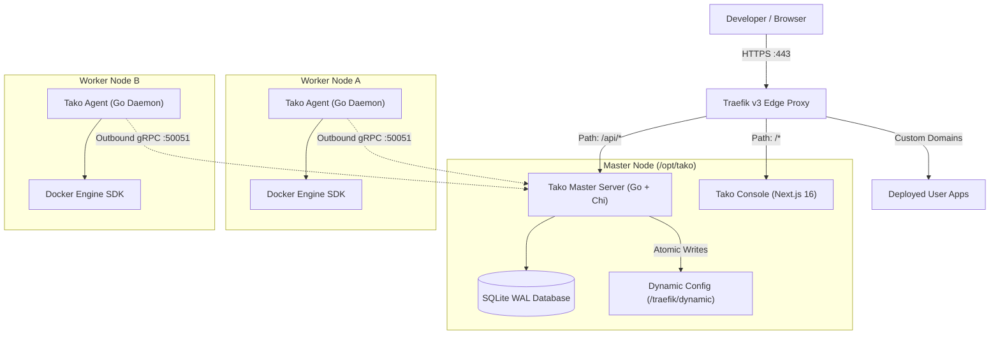

<div align="center">


# Tako

**The lightweight, self-hosted deployment platform.**  
Outbound gRPC node orchestration, automated Let's Encrypt TLS, dynamic Traefik routing, and WebAuthn authentication.

[](https://golang.org)
[](https://docs.gettako.dev)
[](LICENSE)
[](CONTRIBUTING.md)

[Quickstart](#quick-start) • [Architecture](#architecture) • [Documentation](https://docs.gettako.dev) • [Contributing](CONTRIBUTING.md)

</div>

---

## Overview

**Tako** is an open-source, self-hosted platform for deploying applications across one or more servers without running heavy control plane databases or opening SSH ports on remote worker nodes.

> [!WARNING]
> **Active Development**: Tako is in active development and early preview. Features, schemas, and configurations may change between releases.

- **Outbound-only agent architecture:** Worker nodes initiate an outbound gRPC stream to the master server. Remote hosts require no inbound management ports and no SSH keys.
- **Embedded SQLite persistence:** The master server runs as a static Go binary using embedded SQLite in WAL mode, keeping idle memory usage under 50 MB.
- **Dynamic Traefik v3 edge routing:** Ingress routing and Let's Encrypt TLS certificate provisioning run automatically with zero-downtime cutover gates.
- **Standard Docker tooling:** Deploy straight from Git repositories using your own `Dockerfile` or `docker-compose.yml` stacks.
- **Modern identity:** Native WebAuthn passkeys (Touch ID, Face ID, hardware security keys), TOTP two-factor authentication, and secure session management.

For in-depth guides, architectural deep dives, and tutorials, visit the official documentation at **[docs.gettako.dev](https://docs.gettako.dev)**.

---

## Architecture



---

## Quick Start

### 1. Install Master Server

Install the Tako master node (control plane, web console, Traefik v3, and database) on any clean Linux machine running Ubuntu, Debian, or Rocky Linux:

```bash
curl -fsSL https://gettako.dev/install.sh | bash
```

The installer configures the console domain, admin credentials, and edge proxy. Once finished, open your console domain in a browser to log in.

### 2. Attach Worker Nodes (Optional)

To add compute capacity across different providers or bare-metal servers:

1. In the console, go to **Nodes** → **Enroll Node** to generate an enrollment token.
2. Run the agent installer on the target worker machine:

```bash
curl -fsSL https://gettako.dev/install.sh | bash -s -- --agent
```

3. Enter your master server gRPC address and enrollment token when prompted. The agent connects outbound over TLS.

For complete deployment options, see the [Installation Guide](https://docs.gettako.dev/quickstart/installation).

---

## Monorepo Layout

```
gettako/
├── agent/            # Go node daemon using Docker Engine SDK
├── api/              # OpenAPI 3.1 specification (openapi.yaml) & Protocol Buffers (proto/)
├── console/          # Next.js 16 dashboard (React 19, Tailwind CSS v4)
├── deploy/           # Production installer (install.sh), Compose stacks, Traefik config
├── docs/             # Technical documentation source (Mintlify MDX)
└── server/           # Go master orchestrator (Chi REST/SSE, SQLite WAL, gRPC server)
```

---

## Local Development

```bash
# 1. Clone repository
git clone https://github.com/gettako/tako.git
cd tako

# 2. Run master server
cd server
cp .env.example .env
go run ./cmd/server

# 3. Run node agent (in a separate terminal)
cd ../agent
cp .env.example .env
go run ./cmd/agent

# 4. Run web console (in a separate terminal)
cd ../console
npm install
npm run dev
```

Open [http://localhost:3000](http://localhost:3000) to access the console.

Review [CONTRIBUTING.md](CONTRIBUTING.md) for coding standards, commit formatting, and testing workflows.

---

## Documentation

Comprehensive documentation, API specs, and operational guides are hosted at **[https://docs.gettako.dev](https://docs.gettako.dev)**:

- [Why Tako? Architectural Trade-offs & Comparisons](https://docs.gettako.dev/why-tako)
- [System Architecture](https://docs.gettako.dev/concepts/architecture)
- [Quickstart: First Deployment](https://docs.gettako.dev/quickstart/first-deploy)
- [Multi-Server Orchestration](https://docs.gettako.dev/guides/adding-a-server)
- [Interactive API Reference](https://docs.gettako.dev/api-reference)

---

## Contributing

We welcome contributions, bug reports, and pull requests. Please read [CONTRIBUTING.md](CONTRIBUTING.md) before submitting changes.

---

## License

Tako is open source software licensed under the **Apache License, Version 2.0**. See [LICENSE](LICENSE) for details.
