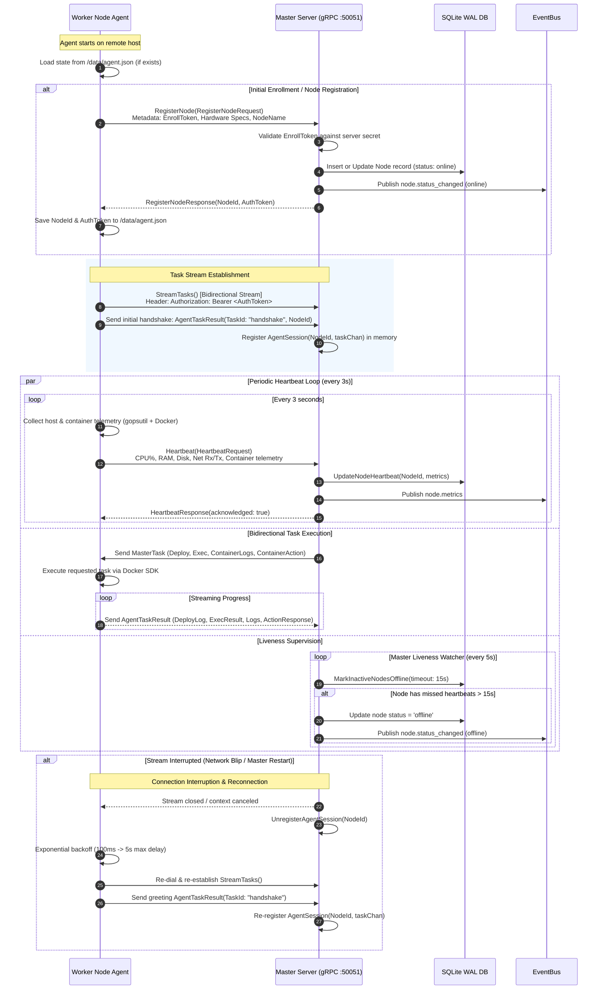

Tako's multi-server architecture is governed by a lightweight **outbound-only agent communication model**. The Master server never attempts to connect into worker nodes; instead, all remote worker daemons establish and maintain long-lived outbound gRPC connections to the Master.

---

## 1. Agent-Server Handshake & Lifecycle Diagram



---

## 2. Protocol Buffers Service Definitions

The communication protocol is formalized in `api/proto/tako/v1/agent.proto`:

### `AgentService`
```protobuf
service AgentService {
  rpc RegisterNode(RegisterNodeRequest) returns (RegisterNodeResponse);
  rpc Heartbeat(HeartbeatRequest) returns (HeartbeatResponse);
  rpc StreamTasks(stream AgentTaskResult) returns (stream MasterTask);
}
```

### Handshake & Enrollment (`RegisterNode`)
1. **Initial Registration:** The agent provides:
   - `node_id` & `name`: Unique node identifier and human-readable hostname.
   - `ip_address` & `public_ip`: Local private network IP and public egress IP.
   - `cpu_total_cores`, `memory_total_mb`, `disk_total_gb`: Discovered physical host capacity.
   - `docker_version`, `os`, `kernel_version`: System diagnostic metadata.
   - `enroll_token`: Master enrollment secret token.
2. **Persistence:** The master responds with an assigned `node_id` and `auth_token` (`tako-agent-<node_id>`), which the agent writes to `/data/agent.json`. Subsequent restarts reuse this identity.

### Bidirectional Task Stream (`StreamTasks`)
Tasks and their results flow across a persistent HTTP/2 bidirectional stream:
- **MasterTask Types:**
  - `MasterTask_Deploy`: Instructs the agent to clone, build, and deploy an application revision.
  - `MasterTask_Exec`: Requests command execution inside a running container.
  - `MasterTask_ContainerAction`: Requests container actions (`start`, `stop`, `restart`, `remove`, `reboot-node`).
  - `MasterTask_ContainerLogs`: Retrieves tail lines of container stdout/stderr.
- **AgentTaskResult Types:**
  - `AgentTaskResult_DeployLog`: Streams deployment step messages and build log chunks.
  - `AgentTaskResult_ExecResult`: Delivers command output and exit code.
  - `AgentTaskResult_ContainerLogs`: Delivers historical log text.
  - `AgentTaskResult_ContainerActionResult`: Confirms action execution.

---

## 3. Resilience & Reconnect Policies

### gRPC Client Keepalive & Backoff
Configured in `agent/internal/client/client.go`:
- **Keepalive Ping:** Client sends HTTP/2 PING frames every 30 seconds with a 5-second timeout (`keepalive.ClientParameters`).
- **Reconnect Backoff:**
  - `BaseDelay`: 100 milliseconds.
  - `Multiplier`: 1.6x exponential increase.
  - `Jitter`: 20% randomization to prevent thundering herd reconnection storms.
  - `MaxDelay`: 5 seconds.

### Server-Side Liveness Watcher
Configured in `server/internal/orchestrator/orchestrator.go`:
- Runs in a background goroutine checking the database every 5 seconds.
- Any node that has not recorded a heartbeat within 15 seconds is marked `status = 'offline'` via `MarkInactiveNodesOffline`.
- The EventBus notifies active console dashboards immediately over Server-Sent Events.
