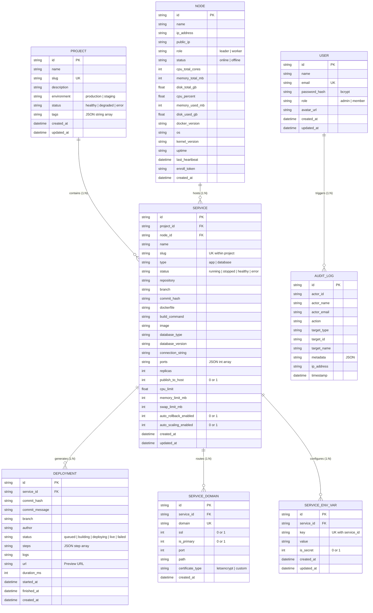

Tako uses a 2-role access control model coupled with a relational SQLite schema designed for high-density multi-service orchestration.

---

## 1. Data Model & Hierarchy Diagram

The diagram below details the entity hierarchy from top-level Projects down to Services, Deployments, and infrastructure Nodes:

---

## 2. Authentication & Authorization Model

### Two-Role Multi-User System
Tako distinguishes between two operational roles:

| Role | Permissions & Capabilities |
| :--- | :--- |
| **`admin`** | Full cluster control: register/reboot/delete worker nodes, manage global cluster settings, rotate API tokens, create/delete users, assign user roles, and trigger backups. |
| **`member`** | Application lifecycle control: create and edit projects, configure service environment variables, trigger deployments, inspect container logs, and view metrics. Restricted from altering node infrastructure or user roles. |

### Credentials & Cryptography
- **Password Storage:** Credentials are authenticated against standard **bcrypt** password hashes (`golang.org/x/crypto/bcrypt`).
- **Initial Bootstrap:** On first startup, the control plane checks for existing users. If the user table is empty, it seeds an initial administrator account using `TAKO_INITIAL_ADMIN_EMAIL` and `TAKO_INITIAL_ADMIN_PASSWORD`.

### Multi-Factor Authentication
- **Time-Based One-Time Passwords (TOTP 2FA):** Configured via `/auth/2fa`.
- **Passkeys (FIDO2 / WebAuthn):** Registered and managed via `/auth/passkeys`.

### Session Architecture
- The Next.js BFF sets HTTP-only cookies (`tako_session` and `tako_user`) configured with `SameSite=Lax` and `Path=/`.
- Client sessions expire after 7 days (`maxAge: 604800`).
- Session revoking and multi-device management are audited via `audit_logs`.
