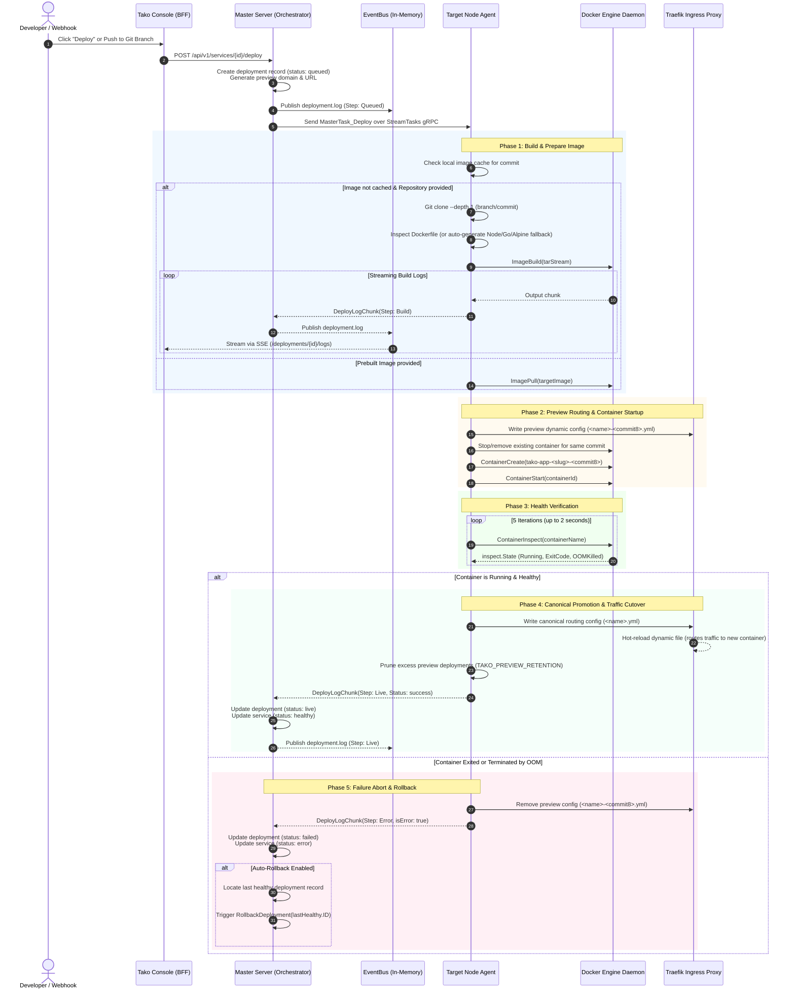

Deployments in Tako are orchestrated asynchronously using a decoupled event-driven pipeline between the Control Plane (`server`) and the target Node (`agent`).

---

## 1. End-to-End Deploy Sequence Diagram

---

## 2. Step-by-Step Execution Phases

### Phase 1: Triggering & Validation
1. **Trigger Origin:** Deployments can be initiated via:
   - **Manual Dashboard Click:** `POST /api/v1/services/{id}/deploy` via the Console.
   - **GitHub Webhook Push:** `POST /api/webhooks/github` automatically matching the repository and branch.
   - **Generic Webhook URL:** `POST /api/webhooks/deploy/{serviceId}?token=...`.
2. **Metadata Generation:**
   - The master server generates a unique deployment ID (`dep-<hex8>`).
   - Generates a preview subdomain (e.g. `<serviceSlug>-<commit8>-<dashedIP>.sslip.io`).
   - Inserts the deployment record into SQLite with `status = "queued"`.

### Phase 2: Agent Task Dispatch
1. The server identifies the target node session in memory (`o.agents[srv.NodeID]`).
2. Constructs a `takov1.DeployRequest` containing:
   - Git repository, branch, Dockerfile path, build command, target image name.
   - Service container environment variables.
   - Target port mappings and domain routing list.
   - Resource limits (CPU limit, Memory limit MB, Swap limit MB).
3. Transmits the task into the agent's active gRPC task stream channel.

### Phase 3: Cloning & Building
1. **Local Image Cache Check:** If the image for the specified commit was already built on this node, build is skipped.
2. **Shallow Clone:** Executes `git clone --depth 1` into a temporary directory (`/tmp/tako-repo-*`).
3. **Dockerfile Fallback Detection:**
   - If `Dockerfile` exists: builds directly.
   - If missing but `package.json` exists: automatically generates a standard Node.js 20 production container.
   - If missing but `go.mod` exists: automatically generates a multi-stage Go 1.24 builder container.
   - Otherwise: generates a minimal Alpine fallback.
4. **Log Streaming:** Docker build progress is scanned line-by-line and streamed back to the server over gRPC as `DeployLogChunk` messages.

### Phase 4: Container Launch & Resource Limits
1. The agent stops and removes any existing container matching `tako-app-<serviceName>-<commit8>`.
2. Attaches the container to the Docker bridge network `tako-network`.
3. Injects environment variables and mounts persistent database volumes if the image is detected as PostgreSQL, MySQL, Redis, or MongoDB (`tako-data-<serviceName>`).
4. Enforces hardware limits:
   - `NanoCPUs = req.CpuLimit * 1e9`
   - `Memory = req.MemoryLimitMb * 1024 * 1024`
   - `MemorySwap = req.MemoryLimitMb * 1024 * 1024` (unless configured otherwise)

### Phase 5: Health Check & Promotion
1. **Health Verification Loop:** Inspects container state 5 times over ~2 seconds.
   - If `State.Running == false` with non-zero exit code: fails immediately.
   - If `State.OOMKilled == true`: fails with OOM diagnostic error.
2. **Dynamic Traefik Promotion:**
   - On success: writes the production canonical routing configuration to `/etc/tako/traefik/dynamic/<serviceName>.yml`.
   - Traefik's internal inotify file watcher detects the file write and switches live ingress traffic to the new container hostname with zero dropped requests.
3. **Retention Pruning:** Inspects local containers and removes older preview containers exceeding `TAKO_PREVIEW_RETENTION` (default: 2 preview versions).
