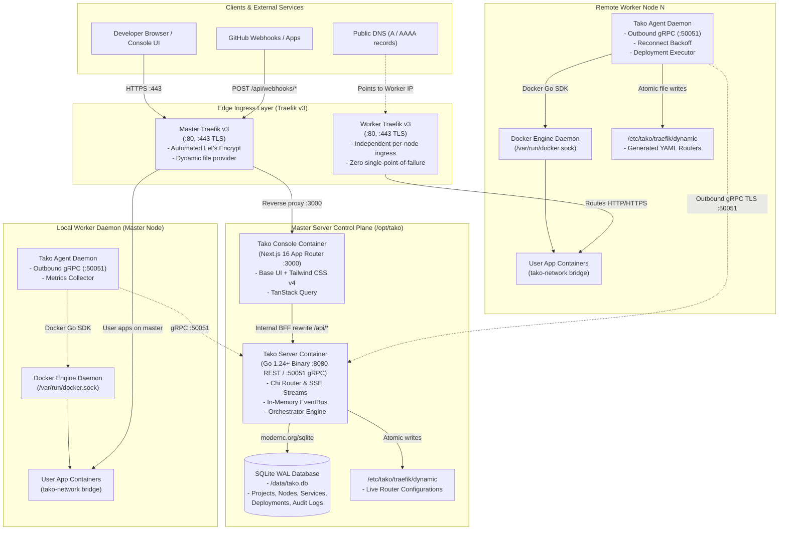

Tako is a self-hosted, multi-server deployment platform designed as an alternative to Dokploy and Coolify. Its primary architectural philosophy is **outbound-only agent orchestration**: remote worker nodes initiate outbound persistent gRPC connections over TLS to the central control plane, eliminating the need to expose inbound SSH ports (port 22) or Docker daemon sockets to the public internet.

---

## 1. System Topology Diagram

The diagram below illustrates the end-to-end architecture across the Master Node, Worker Nodes, the edge proxy layer, and developer entrypoints.

---

## 2. Core Architectural Principles

### 1. Outbound-Only Node Communication
Worker nodes connect **outbound** to the master server via gRPC (`:50051`). Remote nodes require no inbound ports open other than public HTTP (`80`) and HTTPS (`443`) for application traffic.
- No SSH keys or SSH tunnels are managed by the control plane.
- Worker nodes can sit behind NAT, firewalls, or dynamic IP connections.
- The control plane streams deployment tasks and management commands over an established bidirectional stream (`StreamTasks`).

### 2. Embedded Control Plane Persistence
The master server uses an embedded **SQLite database running in WAL mode** (`modernc.org/sqlite`).
- Zero external database dependencies (no PostgreSQL or MySQL container required to run Tako itself).
- Sub-50MB idle memory footprint for the entire control plane binary.
- Atomic schema migrations managed with Goose.

### 3. Decentralized Edge Routing
Instead of centralizing all traffic through a single ingress choke point:
- Each server (master and workers) runs its own dedicated **Traefik v3** instance.
- User application DNS records (`A` and `AAAA`) point directly to the server where the container is deployed.
- Container failures or network issues on one node never degrade ingress routing on other nodes.

### 4. Direct Docker Engine Integration
Both master and worker nodes interact with Docker Engine via the official **Docker Go SDK** through the UNIX socket (`/var/run/docker.sock`). Containers are attached to an isolated bridge network (`tako-network`) by default.
