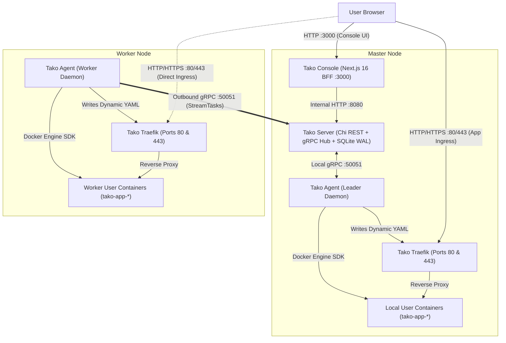

# Architecture Overview

Tako is designed around an **Agent-First, Ingress-Separated** topology that eliminates the architectural pitfalls of older PaaS solutions.

## High-Level Topology

## Key Principles

### 1. Clean Ingress Separation
Tako Console runs directly on port **`3000`**, isolated from Traefik on ports **`80`** and **`443`**. Application routing is managed via Traefik's dynamic file provider with explicit priority (`priority: 100`), while a catch-all fallback router (`priority: 1`) routes unmapped host requests on ports 80/443 to the console. This guarantees that user application traffic, DNS misconfigurations, or Let's Encrypt rate-limiting can never lock you out of the management dashboard.

### 2. Zero-SSH Agent Communication
Worker nodes never listen on SSH ports or incoming management ports for cluster control. Instead, `tako-agent` dials outward to `tako-server:50051` establishing a persistent bidirectional gRPC stream (`StreamTasks`). Master tasks (deployments, container start/stop/restart, exec commands, and logs) are dispatched over this tunnel, allowing workers to run safely behind strict corporate firewalls, NAT gateways, and private cloud VPCs.

### 3. Pure-Go Embedded SQLite in WAL Mode
By using SQLite with Write-Ahead Logging (WAL) and the pure-Go driver (`modernc.org/sqlite`), Tako eliminates external database containers like PostgreSQL, MySQL, or Redis for the control plane. SQLite in WAL mode delivers sub-millisecond query performance, concurrent read scalability, and instant atomic backups.

### 4. Dynamic File-Driven Traefik Ingress
Rather than relying solely on Docker labels (which require container restarts or Docker API polling), Tako Agent writes dynamic YAML routing files directly into `/etc/tako/traefik/dynamic/`. This ensures immediate routing updates, deterministic SSL challenge isolation, and distinct handling for production custom domains versus ephemeral preview domains (`sslip.io`).
