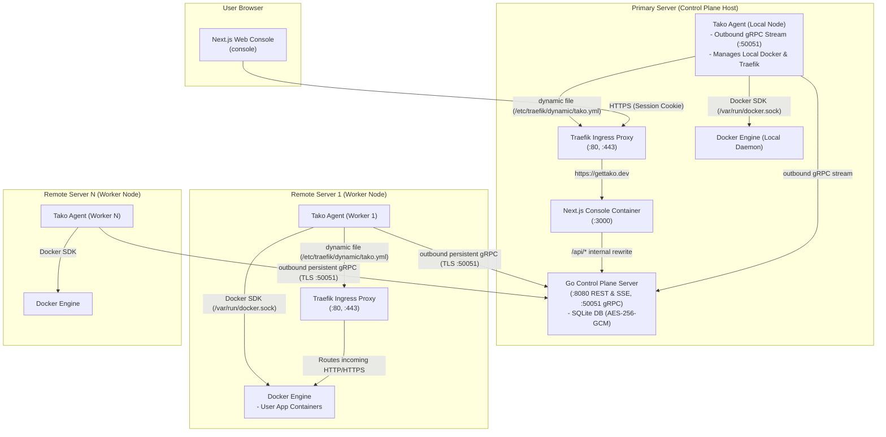

Tako follows a hub-and-spoke control plane topology. The control plane is deployed once on a primary node. All managed nodes, including the primary node itself, run a lightweight **Tako Agent** alongside an instance of **Traefik**.

## Topology Diagram

The diagram below details the communication paths and connection directions between the browser, control plane, node agents, Traefik proxies, and local Docker daemons:

---

## Architectural Invariants

### 1. Zero direct Docker access from the control plane
The Go Control Plane (`server`) never mounts or connects to the host Docker socket (`/var/run/docker.sock`). All container operations, image builds, log streams, and prune actions are delegated to an agent over gRPC. This keeps the control plane strictly decoupled from the underlying container runtime.

### 2. Uniform local agent execution model
The primary server runs a node agent identical to remote servers. To the control plane orchestrator, the primary server is simply a node named "Local" with an active gRPC session. This ensures that a single code path handles deployments regardless of whether an app runs on the primary node or a remote cluster server.

### 3. Outbound-only agent connectivity
Remote worker nodes establish **outbound connections** to the control plane gRPC server on port `50051`.
- Remote servers do not need port 22 or any management ports open to the public internet.
- Worker nodes operate behind NAT, firewalls, and dynamic IP addresses without port forwarding.
- Only standard HTTP (`80`) and HTTPS (`443`) traffic must be permitted inbound on worker servers for public application routing.

### 4. Decentralized per-node Traefik ingress
Each managed server runs its own independent Traefik v3 container.
- Domain `A` and `AAAA` records point directly to the public IP of the server running the respective service.
- If one server encounters network disruption, services running on other servers remain online.
- No central edge gateway creates a single point of failure or bandwidth bottleneck.

---

## Component Responsibilities

### Next.js Web Console (`console`)
- Built with Next.js 16 (App Router), Base UI (`base-vega` style), and Tailwind CSS v4.
- Runs server-side rendering (SSR) on port `3000`.
- Acts as a same-origin proxy: all client requests to `/api/*` are rewritten internally to `http://server:8080/api/*`.
- Authentication uses secure `HttpOnly; SameSite=Lax; Secure` cookies, preventing token leakage through client-side scripts.

### Go Control Plane Server (`server`)
- Written in Go 1.24+ using `chi` for HTTP routing.
- Exposes REST endpoints for CRUD operations and Server-Sent Events (SSE) for real-time build and runtime log streaming.
- Manages an embedded SQLite database with Write-Ahead Logging (WAL) and AES-256-GCM encryption for stored secrets.
- Runs a gRPC coordinator on port `50051` that receives outbound agent connections.

### Tako Node Agent (`agent`)
- Written in Go as a lightweight host daemon.
- Connects outbound to the control plane over persistent gRPC with TLS.
- Interacts with the local Docker daemon over `/var/run/docker.sock` using the official Docker Engine SDK.
- Writes dynamic routing rules to Traefik using the file provider (`/etc/traefik/dynamic/tako.yml`).
- Collects host and container telemetry (CPU, RAM, disk, network) every 15 to 30 seconds.

### Traefik Reverse Proxy (`traefik`)
- Dedicated Traefik v3 proxy instance on each server.
- Listens on ports `80` and `443`.
- Automatically solves Let's Encrypt ACME HTTP-01 challenges on port `80`.
- Watches `/etc/traefik/dynamic/` for instant configuration updates without restarts.

---

## Deep-Dive Technical References

For in-depth specifications, protocol contracts, and sequence diagrams, explore the technical architecture series:

- [Architecture Overview & Topology](/architecture/overview)
- [Component Breakdown & Packages](/architecture/components)
- [Deploy Flow & Zero-Downtime Swaps](/architecture/deploy-flow)
- [Agent Protocol & Multi-Server Model](/architecture/agent-protocol)
- [Auth Model & Entity Relationships](/architecture/auth-and-permissions)
