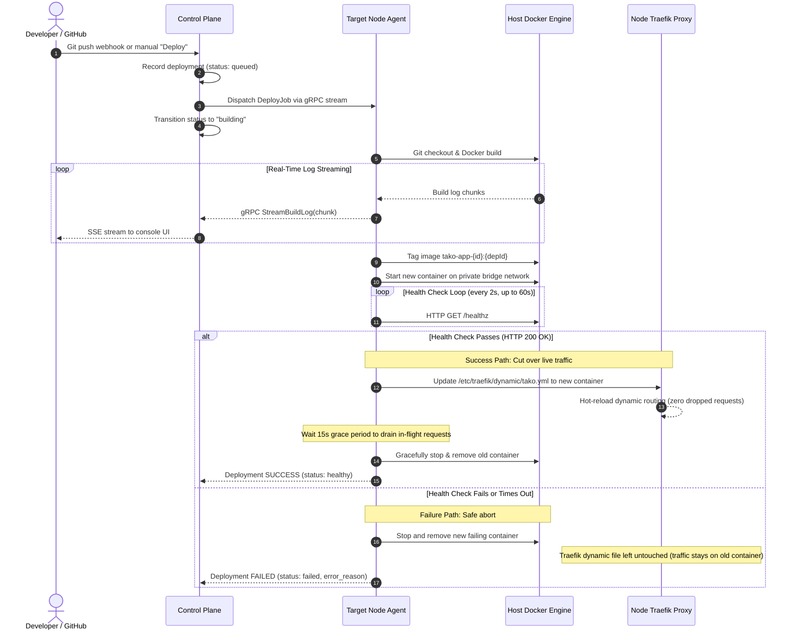

Deployments in Tako are engineered around an essential guarantee: **zero downtime**. A new deployment will never take down your running application if a build succeeds but the container fails to start, crashes on boot, or fails health checks.

## Deployment Lifecycle Flow

The sequence diagram below details the entire deployment pipeline, including live log streaming and the decision branch between the success cutover path and the failure recovery path:

---

## Detailed Pipeline Phases

### 1. Queuing and Dispatch
When a deployment is triggered:
- The control plane checks whether the service is already building. If an active build is in progress, the new request is queued.
- The control plane retrieves encrypted environment variables and build arguments from SQLite, decrypts them in memory, and constructs a `DeployJob` message.
- The job is dispatched over the target server agent's persistent gRPC connection.

### 2. Git Clone and Image Construction
The worker node agent receives the job payload:
- It clones or fetches the specific commit SHA from GitHub using the configured connection credentials.
- It invokes the Docker Engine API to build the image using the specified `Dockerfile` path.
- Build arguments are passed directly to Docker BuildKit.
- Standard output and error lines are multiplexed and streamed in real time back to the control plane, where users can monitor progress in the web console.

### 3. Isolated Container Startup
Once the image build completes:
- The agent tags the image as `tako-app-{service_id}:{deployment_id}`.
- A new container is launched attached to the isolated bridge network `tako_network`.
- The container is assigned an internal IP address and container port. At this point, **no external traffic reaches the container**.

### 4. Health Check Verification Gate
Before shifting traffic, the agent verifies application readiness:
- The agent sends periodic HTTP GET requests (every 2 seconds) to the configured health check endpoint (e.g., `/healthz` or `/`).
- The application must respond with an HTTP status code between `200` and `299`.
- The agent continues checking until the container passes or the timeout window (default 60 seconds) expires.

---

## The Zero-Downtime Guarantee: Success vs Failure

### The Success Path (Cutover)
If the new container passes health checks:
1. **Dynamic route update:** The agent updates Traefik's dynamic file provider (`/etc/traefik/dynamic/tako.yml`), changing the router backend URL to the new container's internal IP and port.
2. **Instant reload:** Traefik detects the file modification and hot-reloads its routing table in memory without dropping connections.
3. **Connection draining:** The agent waits for a 15-second grace period, allowing any active in-flight requests on the previous container to complete cleanly.
4. **Old container teardown:** The previous container is sent a `SIGTERM` signal, stopped, and removed.
5. **Image retention:** The previous image tag is preserved locally to support instant rollbacks.

### The Failure Path (Safe Abort)
If the health check fails or times out:
1. **Old container untouched:** Traefik's routing configuration is **never modified**. All existing public traffic continues reaching the previous, working container.
2. **Cleanup:** The new, broken container is stopped and removed immediately to free system memory and port allocations.
3. **Reporting:** The agent reports the failure along with the last recorded container error logs to the control plane, marking the deployment as **Failed**.
4. **Zero user impact:** Visitors to your application experience no interruption or downtime.
