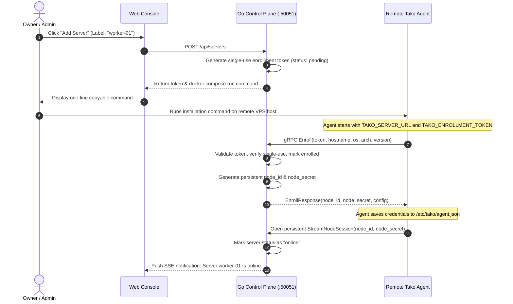

Tako allows you to manage multiple remote servers from a single web dashboard. Remote machines can be provisioned on any cloud provider (such as Hetzner, DigitalOcean, AWS, or bare metal) as long as they run Linux and standard Docker.

## Server Registration Sequence

Attaching a new worker server to Tako requires zero manual SSH key configuration and zero open management ports. The sequence below shows the exact handshake between the console, control plane, and remote agent:

---

## Detailed Step Breakdown

### 1. Enrollment Token Generation
When an administrator clicks **Add Server** in the web console:
- The control plane generates a cryptographically random, single-use token (`tok_<hex32>`) with a 15-minute expiration window.
- A server record is written to SQLite with `status = "pending"`.
- The console renders a ready-to-run installation snippet containing the token and gRPC server address.

### 2. Remote Node Initialization
On the target Linux machine, running the installation script launches two Docker containers:
- **`tako-agent`:** The Go worker daemon that establishes the outbound connection.
- **`tako-traefik`:** The node reverse proxy that handles incoming web traffic on ports 80 and 443.

### 3. Mutual Authentication & Node Credentials
When the agent launches:
1. It reads `TAKO_SERVER_URL` and `TAKO_ENROLLMENT_TOKEN` from its environment.
2. It sends an `Enroll` RPC containing system metadata (hostname, OS, architecture, agent version) and the one-time token over gRPC TLS.
3. The control plane validates the token, invalidates it immediately to prevent reuse, and generates a permanent 32-byte `node_secret` bound to the generated `node_id`.
4. The agent writes this credential file to `/etc/tako/agent.json` in a persistent Docker volume. Future restarts authenticate using this secret directly without requiring a token.

### 4. Persistent Bidirectional Session (`StreamNodeSession`)
Immediately following enrollment, the agent opens a long-lived bidirectional gRPC stream:
- **Server to Agent commands:** Dispatch build jobs, container stop/start/restart actions, manual prune requests, and live container terminal sessions.
- **Agent to Server telemetry:** Real-time build log chunks, runtime container logs, and health check status reports.

---

## Heartbeats & Node Status Transitions

The Tako Agent sends telemetry pings over the open gRPC stream every 15 seconds. Each heartbeat includes:
- Host CPU utilization percentage.
- Host memory (RAM) used and total bytes.
- Host disk utilization.
- Count of active, stopped, and unhealthy containers.

The control plane tracks node liveness based on heartbeat arrival times:

| Node Status | Criteria | UI Indicator |
|---|---|---|
| **Online** | Last heartbeat received within 30 seconds. | Green pill badge |
| **Degraded** | No heartbeat received between 30 and 60 seconds. | Yellow pill badge |
| **Offline** | No heartbeat received for more than 60 seconds. | Red pill badge |

If a worker node goes offline, the control plane leaves container records intact and alerts the administrator. When connectivity is restored, the agent automatically reconnects and synchronizes state.

---

## Automated Disk Maintenance & Pruning

Over time, frequent deployments accumulate dangling Docker image layers and build cache. The Tako Agent provides automated maintenance:
- **Automatic Pruning:** Periodically runs Docker image pruning to remove dangling layers and BuildKit cache entries older than 7 days.
- **Image Retention Policy:** Keeps the Docker images corresponding to the last 5 successful deployments per service, guaranteeing that one-click rollbacks work instantly without downloading or rebuilding images.
- **Manual Pruning:** Administrators can trigger an immediate cleanup at any time from the Server Settings menu in the web console.
