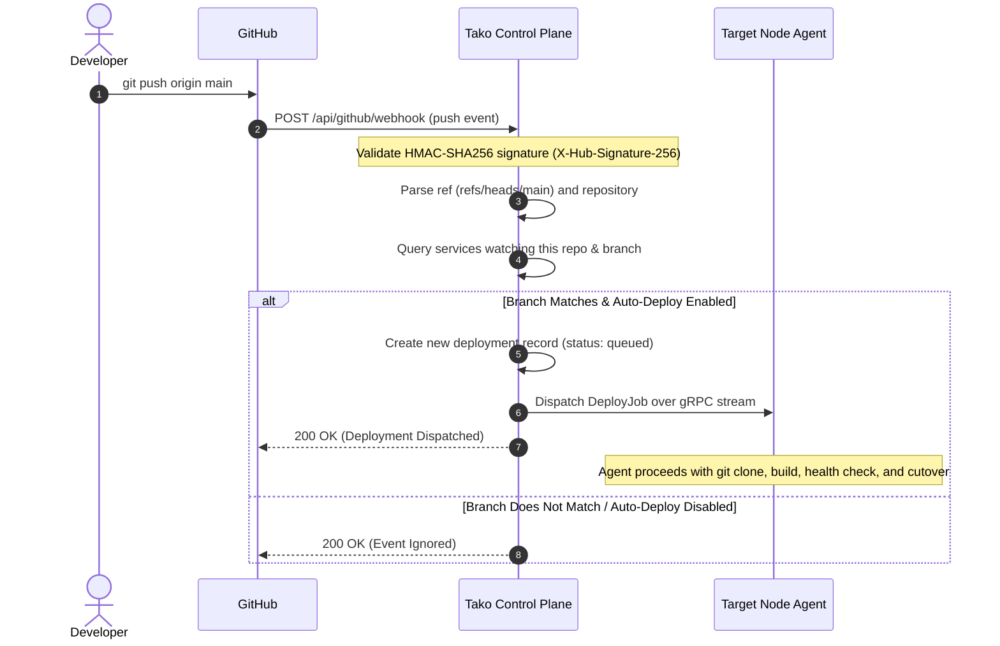

Connecting GitHub enables Tako to list repositories, clone private code, and automatically trigger zero-downtime deployments whenever you push changes to your configured branch.

## Webhook Deployment Workflow

The diagram below illustrates how a `git push` event in GitHub triggers an automated deployment in Tako:



---

## Connection Methods

Tako supports managing multiple GitHub connections across personal and organization accounts:

### Method 1: GitHub App (Recommended)
Using a GitHub App provides fine-grained repository permissions, automated webhook installation, and support for multiple GitHub organizations.

1. Navigate to **Settings** and select **GitHub Connections**.
2. Click **Create GitHub App**.
3. Tako will generate a GitHub App manifest and redirect you to GitHub to authorize creation.
4. Select which personal or organization account should own the App.
5. Choose whether to grant access to **All repositories** or **Only select repositories**.
6. GitHub will redirect back to Tako, which exchanges the manifest credentials, installs the webhook secret, and marks the connection active.

### Method 2: Personal Access Token (PAT)
If you prefer a direct setup using a classic token:

1. In GitHub, go to **Settings > Developer Settings > Personal Access Tokens > Tokens (classic)**.
2. Generate a token with the following scopes:
   - `repo`: Full control of private repositories.
   - `admin:repo_hook`: Optional, required if you want Tako to create webhooks automatically.
3. In Tako, go to **Settings > GitHub Connections** and click **Add PAT Connection**.
4. Enter a connection label and paste the generated token.
5. Click **Verify & Save**.

---

## Setting Up Webhooks Manually

If you used a Personal Access Token without `admin:repo_hook` permissions, configure the webhook manually in GitHub:

1. Open your repository on GitHub and click **Settings > Webhooks > Add webhook**.
2. Set the **Payload URL** to:
   ```
   https://controlplane.yourdomain.com/api/github/webhook
   ```
   *(Or copy the specific connection webhook URL provided on the GitHub Connections settings page).*
3. Set **Content type** to `application/json`.
4. Set the **Secret** to the webhook secret configured in your Tako environment (`TAKO_GITHUB_WEBHOOK_SECRET`).
5. Under **Which events would you like to trigger this webhook?**, select:
   - **Just the push event** (for standard deployments).
   - **Let me select individual events** and check both **Pushes** and **Pull requests** if you intend to use Pull Request Preview Deployments.
6. Click **Add webhook**.

---

## Pull Request Preview Deployments

When configured with Pull Request events:
- Opening or synchronizing a pull request automatically creates an ephemeral child preview service.
- The service is assigned an isolated subdomain (e.g., `pr-12.example.com` or `pr-12.192-168-1-1.sslip.io`).
- Closing or merging the pull request automatically tears down the preview container, frees memory, and cleans up the routing configuration.
