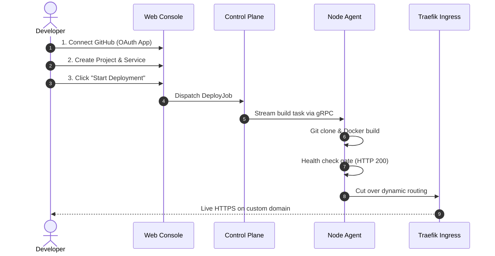

This guide walks you through connecting your GitHub account, creating a project, configuring a service, and deploying an application with zero downtime and automatic SSL.

## Step 1: Connect GitHub

Before creating a service, connect your GitHub account so Tako can clone your repositories and receive push webhooks:

1. In the sidebar, navigate to **Settings** and select **GitHub Connections**.
2. Click **Add Connection**.
3. Choose your preferred connection method:
   - **GitHub App (Recommended):** Grants fine-grained repository access, installs webhooks automatically, and works with both personal and organization accounts.
   - **Personal Access Token (PAT):** Quick setup using a token with `repo` read permissions.
4. Once verified, Tako will display the connected account and list your available repositories.

## Step 2: Create a Project

Projects group related applications, databases, and worker services together:

1. From the dashboard header, click **New Project** (or navigate to **Projects**).
2. Enter a name for your project, such as `acme-platform`.
3. Optionally add a short description.
4. Click **Create Project**.

## Step 3: Configure a Service

Inside your newly created project:

1. Click **Create Service**.
2. Select **Git Repository (Dockerfile)**.
3. Configure the source repository:
   - **Repository:** Select your repository from the dropdown.
   - **Branch:** Choose the branch to watch for deployments (e.g., `main`).
   - **Dockerfile path:** Specify the path relative to the repository root (default is `./Dockerfile`).
4. Select the target server:
   - Choose `Local` for a single-server setup, or select any connected remote worker server.
5. Set the application port:
   - Enter the internal port your container listens on (e.g., `3000` for Next.js, `8080` for Go, `8000` for Laravel).
6. Configure the health check path:
   - Set an endpoint that returns HTTP 200 when ready (e.g., `/healthz` or `/`).
7. Click **Create Service**.

## Step 4: Add Environment Variables

If your application requires configuration or database credentials:

1. Click on your service and open the **Environment** tab.
2. Add your environment variables:
   - **Runtime Environment Variables:** Injected into the container when it starts. These are encrypted at rest with AES-256-GCM.
   - **Build Arguments:** Passed to `docker build --build-arg` during image construction. Use these only for non-sensitive build values.
3. Click **Save Changes**.

## Step 5: Trigger the First Deployment

1. On the service overview page, click **Deploy**.
2. Select the commit or leave it set to the latest commit on your chosen branch.
3. Click **Start Deployment**.
4. The console automatically opens the **Deployments** tab and streams the build log line-by-line via Server-Sent Events (SSE).
5. Watch the build pipeline progress:
   - Git repository checkout.
   - Docker image build layers.
   - Starting the new container on an internal bridge port.
   - Polling the HTTP health check endpoint until it returns HTTP 200.
   - Updating Traefik routing rules to shift live traffic.
   - Status switches to **Healthy**.

## Step 6: Add a Custom Domain and SSL

To expose your application to the public internet:

1. Navigate to the **Domains** tab in your service.
2. In your DNS provider (e.g., Cloudflare, Namecheap, Route53), create an `A` record pointing your domain (e.g., `app.yourdomain.com`) to the public IP address of the target server where your service is deployed.
3. In Tako, click **Add Domain**.
4. Enter your domain name and target port.
5. Traefik will automatically handle the Let's Encrypt HTTP-01 challenge. Within 30 to 60 seconds, the domain status badge changes to **Active** with a valid SSL certificate.
