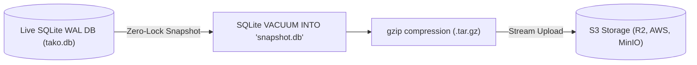

Reliable backups are critical for production self-hosting. Tako provides two distinct backup layers: **Control Plane Snapshots** and **Service Database & Volume Backups**. Both integrate with universal S3-compatible object storage.

## S3 Storage Destinations

All backup operations consume endpoints configured in the centralized **S3 Destinations** registry.

### Supported S3 Providers
- **Cloudflare R2:** Recommended for zero egress bandwidth fees.
- **AWS S3:** Standard Amazon Web Services S3 buckets.
- **MinIO:** Self-hosted, private S3-compatible object storage.
- **Backblaze B2 & Wasabi:** Affordable cloud object storage alternatives.

### Configuring a Storage Destination
1. Navigate to **Settings** and select **Storage Destinations**.
2. Click **Add S3 Destination**.
3. Fill in your provider details:
   - **Label:** Friendly name (e.g., `cloudflare-r2-backups`).
   - **Bucket Name:** Name of your storage bucket.
   - **Region:** AWS region or `auto` for Cloudflare R2.
   - **Endpoint URL:** Custom API endpoint URL (e.g., `https://<account_id>.r2.cloudflarestorage.com`). Leave empty for standard AWS S3.
   - **Access Key ID & Secret Access Key:** S3 credentials with read and write permissions to the bucket.
   - **Force Path Style:** Enable for MinIO and providers requiring path-style bucket URLs (`endpoint/bucket`).
4. Click **Test Connection** to verify that Tako can successfully write, read, and delete test objects.
5. Click **Save Destination**.

---

## 1. Control Plane Backups (SQLite State)

The Tako control plane persists projects, service configurations, encrypted environment variables, users, and audit records in an embedded SQLite database.

### Zero-Lock Online Snapshots
Copying an active SQLite database file directly while in Write-Ahead Logging (WAL) mode risks producing a corrupted snapshot if a write transaction is in flight.

Tako avoids this issue using SQLite's native `VACUUM INTO` command:
1. SQLite creates a clean, checkpointed, and transactionally consistent snapshot file in a single atomic step without locking active readers or writers.
2. The snapshot file is compressed with gzip.
3. The compressed archive is streamed directly to your configured S3 destination.



<Warning>
**CRITICAL: Master Key Retention (`TAKO_SECRET_KEY` / `/etc/tako/master.key`)**

Automated S3 control plane backups export the SQLite database (`tako.db`), which contains encrypted credentials (environment variables, GitHub App private keys, database passwords, and S3 credentials).

**The master encryption key is NEVER included in automated database backups.**
If you restore a control plane backup without your original `TAKO_SECRET_KEY` or `/etc/tako/master.key`, **all encrypted secrets will be permanently lost and unrecoverable**.

Always safely backup your `TAKO_SECRET_KEY` (or the contents of `/etc/tako/master.key`) to a secure password manager or offline secret vault during initial installation.
</Warning>

### Configuring Automated Control Plane Schedules
1. Go to **Settings > Backups**.
2. Select your S3 Storage Destination from the dropdown.
3. Set your backup schedule using standard cron syntax (e.g., `0 3 * * *` for daily at 03:00 UTC).
4. Set the retention count (e.g., retain the last 30 daily backups).
5. Click **Save Schedule**.

You can trigger an immediate backup at any time by clicking **Backup Now**.

---

## 2. Service Database & Volume Backups

Managed databases (PostgreSQL, MySQL, Redis) and application services with persistent volume mounts can be backed up automatically:

- **PostgreSQL:** Uses `pg_dump -Fc` inside the active container to produce a compressed custom format archive.
- **MySQL:** Uses `mysqldump --single-transaction --quick` to produce consistent atomic database dumps.
- **Redis:** Uses `redis-cli --rdb -` to stream an RDB snapshot directly from the Redis process over the Redis protocol to stdout. Note: automatic restore is **not supported**. To restore, stop the Redis container, replace the `dump.rdb` file in the data directory, and restart.
- **Docker Volumes:** Uses `tar -czf` inside the volume mount to create compressed volume snapshots. Note: live `tar` backups of running application volumes are not crash-consistent. Schedule backups during low-traffic windows or ensure your application handles partial writes gracefully.

### Streaming Directly to S3
Backups stream stdout from the container directly to the S3 bucket through the node agent. This prevents VPS disk exhaustion, as multi-gigabyte database dumps never need to be buffered to temporary files on the local host drive.

### Scheduling Service Backups
1. Open the service detail view and select the **Backups** tab.
2. Click **Configure Schedule**.
3. Select your target S3 destination, schedule expression, and retention limit.
4. Click **Save Schedule**.

---

## Disaster Recovery & Restoration

### Restoring the Control Plane on a New Server
If your primary host suffers complete hardware failure:

1. Provision a clean server and install Docker and Compose.
2. Download your latest control plane backup archive (`tako-backup-YYYY-MM-DD-HHMMSS.db.gz`) from your S3 bucket.
3. Decompress the file:
   ```bash
   gzip -d tako-backup-*.db.gz
   ```
4. Move the database file into place:
   ```bash
   sudo mkdir -p /etc/tako
   sudo mv tako-backup-*.db /etc/tako/tako.db
   sudo chmod 600 /etc/tako/tako.db
   ```
5. Ensure your `/etc/tako/.env` contains the original `TAKO_SECRET_KEY` (or restore `/etc/tako/master.key` with `sudo chmod 600 /etc/tako/master.key`) so existing encrypted secrets can be decrypted.
6. Start the Tako control plane stack using `docker compose up -d`. All projects, services, and cluster configurations are restored immediately.

### Restoring a Service Database
1. Open the target service in the web console and select the **Backups** tab.
2. Locate the backup snapshot you wish to restore.
3. Click the action menu and select **Restore**.
4. Confirm the operation. The agent will stream the dump back into the running database container and verify completion.

> [!NOTE]
> **Redis restore is not available via the console.** To restore a Redis database from an RDB backup, you must restore it manually:
> 1. Download the backup file from S3 (`redis-backup-*.rdb.gz`).
> 2. Decompress with `gzip -d redis-backup-*.rdb.gz`.
> 3. Stop the Redis container.
> 4. Replace the `dump.rdb` file in the Redis data volume.
> 5. Restart the container.
