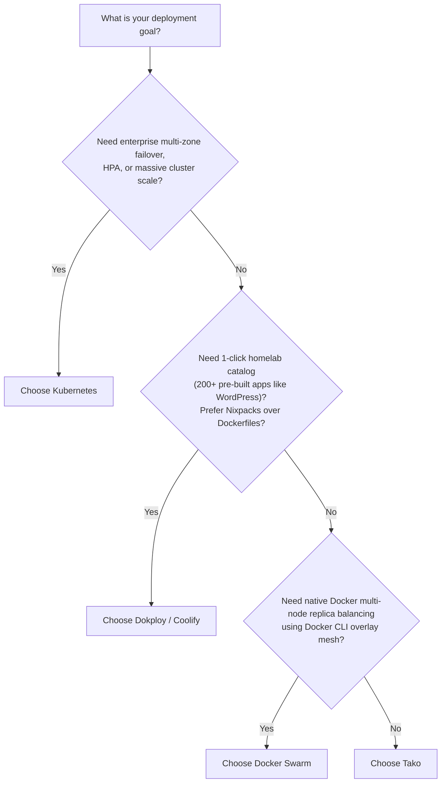

Self-hosting platforms like Dokploy and Coolify showed that developers want the convenience of a modern PaaS on their own virtual private servers. Tako shares that goal, but takes a different engineering approach: deliberate simplicity with fewer moving parts, built specifically for solo developers and small teams shipping custom software.

## Focused Scope Over Feature Sprawl

Many self-hosting tools expand over time into sprawling suites with one-click app catalogs for hundreds of third-party community applications, multi-tenant permission hierarchies, and heavyweight dependencies.

Tako approaches infrastructure with explicit constraints:

1. **Deploying your own code:** Tako focuses strictly on building and shipping your applications using standard Dockerfiles and Compose stacks.
2. **Predictable resource usage:** The master control plane runs as a single Go binary backed by embedded SQLite in Write-Ahead Logging (WAL) mode. It does not require a standalone PostgreSQL or MySQL daemon just to run the panel.
3. **Low operational overhead:** Fewer abstractions mean fewer failure modes. Upgrading or backing up Tako requires copying a single SQLite database file and updating container images.

## Outbound-Only Agent Architecture

The architectural decision that sets Tako apart from traditional deployment tools is its communication model.

In traditional tools, deployment orchestration relies on one of two patterns:

- **Inbound SSH orchestration:** The control plane initiates SSH sessions into every managed worker node. This requires keeping port 22 accessible over the public internet, provisioning root SSH keys, managing firewall allowlists, and handling broken connection drops during shell commands.
- **Inbound agent webhooks:** Remote node daemons expose an HTTP server. This requires opening inbound management ports, provisioning TLS certificates for agent endpoints, and configuring NAT traversal or static public IPs.

Tako reverses the connection direction:

```
[Remote Worker Node]  --- outbound gRPC over TLS (port 50051) --->  [Tako Master Server]
```

Remote worker nodes run the lightweight **Tako Agent** daemon. On boot, the agent initiates an **outbound persistent gRPC stream** to the central master server.

### Practical Benefits of Outbound Streaming

- **Zero inbound management ports:** Firewalls on worker nodes only need public web ports (`80` and `443`) open for application traffic. Port 22 can remain locked down or restricted to an internal VPN.
- **NAT and private network support:** Worker nodes running behind carrier-grade NAT, private subnets, home labs, or dynamic IP connections connect to the master server without port forwarding or public static IPs.
- **Multiplexed bidirectional telemetry:** A single HTTP/2 connection carries real-time deploy commands, cancellation signals, streaming build output, live container logs, and 15-second host heartbeat metrics.

## Minimal Resource Footprint

Tako is designed to run comfortably on affordable virtual private servers (1 GB to 2 GB RAM instances) where system memory is at a premium:

- **Static Go control plane:** The Go server compiles statically with `CGO_ENABLED=0` and runs without heavy runtime environments.
- **Embedded SQLite persistence:** The database uses `modernc.org/sqlite` in WAL mode with AES-256-GCM encryption for credentials. This avoids dedicating 150 MB to 300 MB of RAM to a standalone PostgreSQL or MySQL daemon.
- **Native Docker Engine SDK:** The agent communicates directly with the local Docker daemon over the unix socket `/var/run/docker.sock` rather than invoking shell commands or managing wrapper processes.

---

## Architectural Comparison: Dokploy vs. Kubernetes vs. Swarm vs. Tako

Each platform approaches container deployment from a distinct set of trade-offs:

| Criterion | Dokploy / Coolify | Kubernetes (K8s) | Docker Swarm | Tako |
| :--- | :--- | :--- | :--- | :--- |
| **Control Plane Topology** | Central Web Panel + Worker Nodes | Master nodes (etcd, API server, controller, scheduler) | Swarm Managers (Raft consensus) | Master server (Go + embedded SQLite WAL) |
| **Node Communication** | Inbound SSH (port 22) or Docker socket | Inbound kubelet API (`10250`) + overlay CNI | Gossip protocol (`7946`), control (`2377`), VXLAN (`4789`) | **Outbound-only gRPC over TLS (`50051`)** |
| **Worker Inbound Ports Needed** | Port 22 (SSH) + Web (80/443) | Kubelet port + CNI ports + NodePort | 2377, 7946, 4789 + Web ports | **Ports 80 & 443 only** (no SSH or agent ports) |
| **Ingress & TLS Proxy** | Traefik v2/v3 or Caddy | Ingress Controllers (NGINX, Traefik, Cilium) + cert-manager | Manual reverse proxy or Traefik overlay | Decentralized Traefik v3 with auto Let's Encrypt |
| **Control Plane Idle Memory** | 500 MB – 1.5 GB (Node.js + PostgreSQL + Redis) | 1.5 GB – 3 GB+ (etcd, API server, controllers) | ~100 MB (built into Docker Engine) | **~40 MB – 80 MB** (single Go binary + SQLite) |
| **Build Mechanism** | Nixpacks, Dockerfiles, Buildpacks, 200+ App Templates | External container registry (images pre-built via CI/CD) | Docker CLI image builds / registry | Explicit `Dockerfile` or `docker-compose.yml` |
| **Workload Failover** | Manual node assignment | Automatic pod rescheduling and health healing | Automatic service replica rebalancing | Explicit node assignment; manual cutover |
| **Operational Complexity** | Low to moderate | High to extreme | Low to moderate | Minimal |

### 1. Dokploy (and Coolify)
Dokploy provides an all-in-one homelab and developer dashboard with an extensive marketplace of pre-packaged third-party applications (WordPress, Nextcloud, Ghost, Plausible) and automated Nixpacks builds.

- **Strengths:** 1-click community template catalog; broad homelab popularity; builds applications without writing a Dockerfile.
- **Trade-offs:** Requires inbound SSH access (port 22) into managed servers with root credentials; runs multiple database and cache services (PostgreSQL, Redis) to support the control plane; upstream application templates can break when third-party container tags drift.

### 2. Kubernetes
Kubernetes is the industry standard for distributed, enterprise-scale container orchestration across large server fleets.

- **Strengths:** Multi-zone high availability; automated pod self-healing and rescheduling; horizontal pod autoscaling (HPA); rich ecosystem of CRDs, service meshes, and GitOps tools (ArgoCD, Flux).
- **Trade-offs:** Steep learning curve; high cognitive overhead (hundreds of YAML manifests); substantial control plane resource consumption; requires dedicated platform engineering effort to manage and upgrade safely.

### 3. Docker Swarm
Docker Swarm is Docker's native clustering mechanism built directly into the Docker Engine daemon.

- **Strengths:** Native Docker Compose syntax; simple cluster bootstrap (`docker swarm init`); automated replica balancing and built-in routing mesh.
- **Trade-offs:** Stagnant ecosystem with limited upstream development; overlay networking (VXLAN) can encounter MTU and firewall issues; manager nodes require exposed management ports; lacks built-in Git webhook deployment pipelines, WebAuthn security, and modern dashboard interfaces.

### 4. Tako
Tako is a targeted platform built for solo developers and small teams who want to run and scale custom Docker-based services across servers without Kubernetes complexity or SSH security hazards.

- **Strengths:** Outbound-only gRPC connectivity eliminates open SSH and agent ports on workers; minimal idle resource consumption with Go and embedded SQLite; native WebAuthn/TOTP security; decentralized Traefik v3 routing with zero-downtime deploy cutover gates.
- **Trade-offs:** No 1-click third-party app marketplace; builds require explicit Dockerfiles (no Nixpacks guessing); no automatic container failover across nodes if a host suffers hardware failure.

---

## When to Choose What



### Choose Dokploy (or Coolify) if:
- You want an all-in-one homelab dashboard to deploy third-party open-source applications (WordPress, Ghost, Nextcloud, databases) with a single click.
- You prefer Nixpacks or buildpacks that automatically detect project languages and generate containers without writing a `Dockerfile`.
- You are comfortable opening port 22 and provisioning SSH keys for remote node management.
- You have sufficient VPS memory to run PostgreSQL, Redis, and a Node.js runtime for the control panel.

### Choose Kubernetes if:
- You run distributed microservices across dozens or hundreds of nodes across multiple cloud availability zones.
- You require automated container self-healing: if a server dies, its pods must automatically migrate to other surviving servers.
- You need horizontal pod autoscaling (HPA) driven by traffic metrics or custom Prometheus queries.
- You have dedicated DevOps or platform engineers to operate, monitor, and upgrade the cluster.

### Choose Docker Swarm if:
- You already run multi-container applications with Docker Compose and want native replica scaling across multiple servers without learning Kubernetes.
- You want an overlay routing mesh built directly into the Docker CLI.
- You do not need a built-in web dashboard, automated GitHub App webhooks, or native WebAuthn authentication.

### Choose Tako if:
- You are a solo developer, founder, or small team shipping your own web applications and APIs.
- You want zero-SSH remote node management: worker nodes connect outbound over gRPC, allowing you to keep port 22 closed to the public internet.
- You deploy to affordable 1 GB – 2 GB VPS instances where every megabyte counts, and you want a control plane that idles in tens of megabytes, not hundreds.
- You write explicit, reproducible `Dockerfile` and `docker-compose.yml` configurations for your services.
- You want production-grade edge routing (Traefik v3, automatic Let's Encrypt certificates, zero-downtime cutover gates, rollbacks) configured out of the box.
