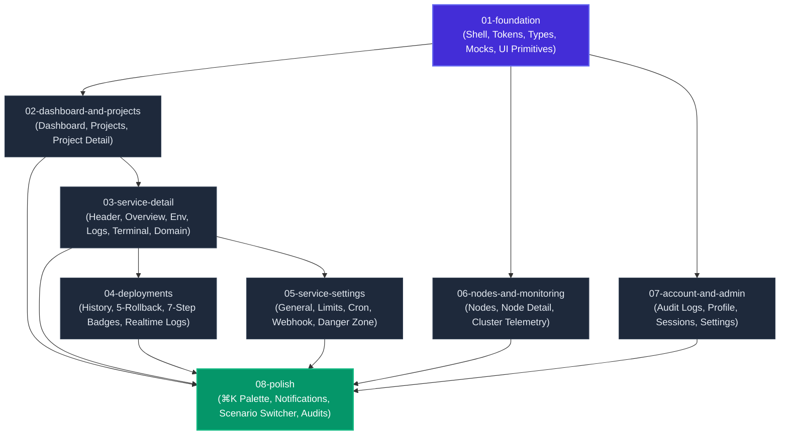

# Tako UI Implementation Plans

This directory contains the comprehensive, staged implementation plans for the **Tako** UI prototype—a modern self-hosted PaaS console (Dokploy alternative).

> **Current Status**: Planning phase complete. Awaiting user approval before proceeding to implementation. No application code has been generated.

---

## 1. Index of Implementation Plans

| Plan ID | Title | File | Status | Blocked By | Blocks |
|---|---|---|---|---|---|
| **01** | Foundation | [`01-foundation.md`](file:///Users/SupianIDz/Work/gettako/plans/01-foundation.md) | `todo` | None | 02, 06, 07 |
| **02** | Dashboard & Projects | [`02-dashboard-and-projects.md`](file:///Users/SupianIDz/Work/gettako/plans/02-dashboard-and-projects.md) | `todo` | 01 | 03, 08 |
| **03** | Service Detail | [`03-service-detail.md`](file:///Users/SupianIDz/Work/gettako/plans/03-service-detail.md) | `todo` | 02 | 04, 05, 08 |
| **04** | Deployments | [`04-deployments.md`](file:///Users/SupianIDz/Work/gettako/plans/04-deployments.md) | `todo` | 03 | 08 |
| **05** | Service Settings | [`05-service-settings.md`](file:///Users/SupianIDz/Work/gettako/plans/05-service-settings.md) | `todo` | 03 | 08 |
| **06** | Nodes & Monitoring | [`06-nodes-and-monitoring.md`](file:///Users/SupianIDz/Work/gettako/plans/06-nodes-and-monitoring.md) | `todo` | 01 | 08 |
| **07** | Account & Admin | [`07-account-and-admin.md`](file:///Users/SupianIDz/Work/gettako/plans/07-account-and-admin.md) | `todo` | 01 | 08 |
| **08** | Polish | [`08-polish.md`](file:///Users/SupianIDz/Work/gettako/plans/08-polish.md) | `todo` | 02, 03, 04, 05, 06, 07 | None |
| **App-A** | Design Extensions (Appendix A) | [`appendix-a-design-extensions.md`](file:///Users/SupianIDz/Work/gettako/plans/appendix-a-design-extensions.md) | `reference` | None | 01 |

---

## 2. Dependency Graph

---

## 3. Current Step

- **Phase**: Ready for User Review.
- **Current Step**: Awaiting user approval on all plan files in `/plans`.
- **Next Step upon Approval**: Execute `01-foundation.md` (documentation updates, CSS variables, domain types, mock data layer, app shell, and shared component primitives).

---

## 4. Decisions and Assumptions

1. **Repository Layout and File Locations**:
   - The Next.js 16 (App Router) web application is located in `/console`.
   - `DESIGN.md` and `AGENTS.md` are actively located at `/console/DESIGN.md` and `/console/AGENTS.md`. `01-foundation` includes a task to verify and align them.
   - All plan artifacts are strictly authored inside `/plans` without touching any application source code.
2. **Design Language & Base Vega Extensions**:
   - Strict adherence to shadcn `base-vega` with Tako Extensions from [Appendix A](file:///Users/SupianIDz/Work/gettako/plans/appendix-a-design-extensions.md).
   - **Airy and spacious**: `px-6 lg:px-8`, `py-6 lg:py-8`, `gap-8` between sections, `p-6` cards, `h-14` table rows.
   - **Status color rule**: Emerald = success/online, Red = danger/unhealthy, Blue = info/running/deploying, Amber = warning/degraded, Neutral gray = stopped/queued.
   - **Blue is status-only**: Blue is never used for brand buttons, active navigation, or focus rings; those strictly use Electric Indigo (`#432DD7` / OKLCH).
   - **Chart palette**: CPU is Indigo, RAM is Emerald, Network is Blue, Disk is Amber. Normal series never use Red.
   - **Subtle glass**: Allowed strictly on header, command palette, popovers/dropdowns, dialog overlays, and toast (`bg-background/70 backdrop-blur-md border border-border/60`).
3. **Ponytail Engineering Discipline**:
   - As mandated, all future implementation code must apply the **ponytail skill**: prefer the simplest working solution, enforce YAGNI, reach for the standard library and native platform features first, avoid premature abstractions, and prioritize code deletion over addition.
4. **Mock Data Layer & Architecture**:
   - All data fetching will execute through typed Promise-returning functions in `lib/api/*` that operate on in-memory mock datasets with realistic artificial delays (150ms–350ms).
   - Domain types live in `lib/types/*` and define the future contract for the Go backend.
   - TanStack Query is used as the client state and caching manager across all views.
5. **Polymorphic Services**:
   - The UI accommodates three distinct service types (`app`, `compose`, `database`). Database services automatically omit the Deployment pipeline tab and instead present dedicated Connection and Backups management tabs.
6. **Virtualized Log Viewer**:
   - Both runtime container logs and simulated realtime build logs leverage virtualized scrolling to handle continuous streaming and large line counts (>500 lines) with Geist Mono typography.

---

## 5. Open Questions

1. **Workspace Root vs `/console` Docs**:
   - `AGENTS.md` and `DESIGN.md` currently reside inside `/console/`. During implementation of `01-foundation`, should symlinks or copies also be maintained at the workspace root `/Users/SupianIDz/Work/gettako/`?
2. **Organization / Workspace Switcher**:
   - The current specification outlines single-cluster project and node management with Owner/Member RBAC. Is a multi-cluster or organization switcher dropdown desired in the header for future multi-tenancy?
3. **Simulated Terminal Shell Extensibility**:
   - The terminal tab plan provides a lightweight simulated shell with standard inspection commands (`help`, `ls`, `ps`, `env`, `clear`). Are there specific custom CLI commands (e.g. `tako status`, `node-info`) that would be valuable in user demos?
4. **Webhook Delivery Mock Payload Diversity**:
   - Webhook deliveries will mock standard GitHub push payloads. Should we also simulate GitLab or Bitbucket event formats in the mock dataset?
